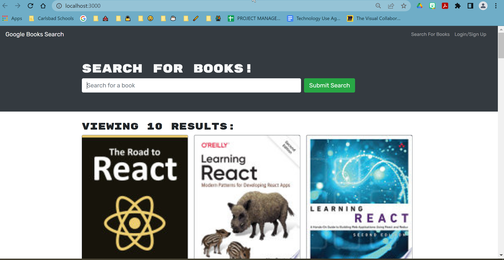

# the_perfect_book :book:

## Table of Contents
- [Description](#description)
- [License](#license)
- [Usage]#(#usage)
- [Questions](#questions)
- [Technologies](#technologies)

## Description
A starter code that still needs refactoring. A application meant to offer users a way to search for new books to read. To be continued . . .

## License

##Usage

## Questions
This is my name and contact info. If you have questions, please reach out!
- :pencil2: Anita Chavez 
- :octocat: [Neeta525](https://github.com/Neeta525)
- :email: starry-days@hotmail.com

## Technologies

